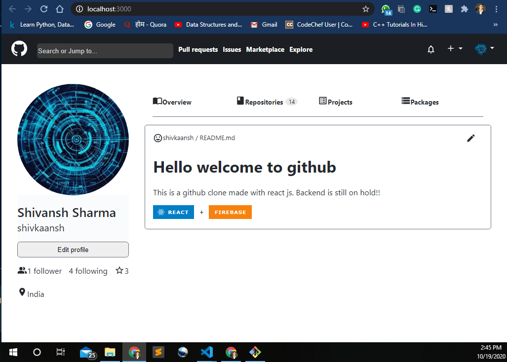

# Github Clone with React JS



React is a powerful tool in the world of web development. Here is a just dummy frontend of github.

## key points

- Backend is still on hold
- Several functionalities missing
- No reloading

## Clone the project
```
git clone https://github.com/shivkaansh/github_clone.git
cd github_clone
npm i
npm start
```
Made with ❤️ and React
